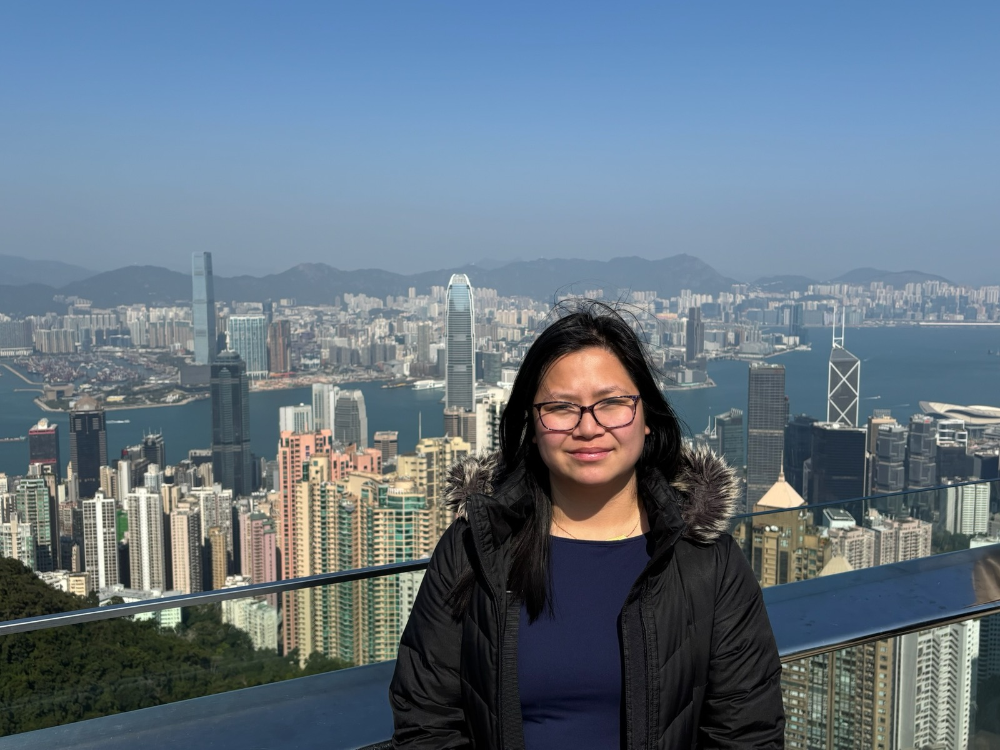

# Welcome
PhD Candidate in Psychology at Univeristy of California, Berkeley

Interested in bias development, culture, socialization, and intergroup cognition

Co-advised by Arianne Eason and Mahesh Srinivasan in the UC DREAMS Lab and LCD Lab 

 

Click [here](KeatingVictoriaCV_6.11.26.pdf) for my CV

Email: victoria_keating@berkeley.edu
